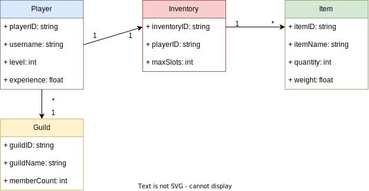

# MD File Formatting Samples
(Note : you can also try and use a .MD text file editor like [Obsidian](https://obsidian.md/download) or [NotebookLM](https://notebooklm.google/app) to automatically format text in .MD format)

# Text Style Examples
# Heading Level 1
## Heading Level 2
### Heading Level 3

Flat text
*italic text*
**bold text**

# Align Examples
<p align='left'>Left align</p>
<p align='right'>Right align</p>
<p align='center'>Right align</p>

# Colored Text Examples
${\color{red}Red}$
${\color{green}Green}$
${\color{lightgreen}Light \space Green}$
${\color{blue}Blue}$
${\color{lightblue}Light \space Blue}$
${\color{black}Black}$
${\color{white}White}$

# Table example
(NOTE : Please use an .MD text file editor for creating this! your authistic colleagues will thank you)

| Cell0,0 | Cell0,1 |
| ------- | ------- |
| Cell1,0 | Cell1,1 |

# Code Block Example
``` Language
Some Code Block
```

# Formulat Block Example
$$
Ax + 4 = 22
$$

# image example


# Diagram example
(NOTE : The following tag will be converted the first time 'make-diagram-images.ps1' is run - please see [using Draw.io for images](../docsgen/drawio-integration.md))
<!-- DRAWIO: game-data-model.drawio -->


