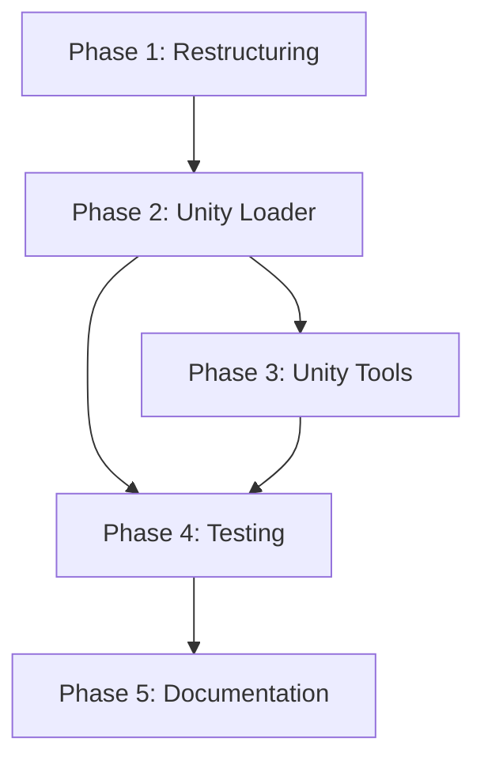

# ULSM Development Roadmap

**Unity Language Server MCP** - A Roslyn-based MCP server for Unity 6.x code analysis

**Issue ID:** PP13-102
**Created:** 2026-02-04
**Base Project:** Fork of [dotnet-roslyn-mcp](https://github.com/brendankowitz/dotnet-roslyn-mcp)

---

## Executive Summary

This roadmap outlines the development of ULSM (Unity Language Server MCP), adapting the existing dotnet-roslyn-mcp codebase to provide Unity-aware C# code analysis via the Model Context Protocol. The key challenges are:

1. **Unity's legacy .csproj format** (ToolsVersion 4.0) requires special MSBuild configuration
2. **Absolute HintPath references** to Unity DLLs need proper resolution
3. **Unity-specific analyzers** (Microsoft.Unity.Analyzers) provide valuable Unity pattern checks
4. **Testing** requires a minimal Unity project for integration validation

---

## Phase 1: Project Restructuring

**Goal:** Rename and rebrand the project from RoslynMcp to ULSM

### 1.1 Namespace Rename

| Current | New |
|---------|-----|
| `RoslynMcp` | `ULSM` |
| `RoslynService` | `ULSMService` (or keep as `RoslynService` within ULSM namespace) |
| `McpServer` | `ULSMMcpServer` |

**Files to modify:**
- `src/Program.cs`
- `src/McpServer.cs`
- `src/RoslynService.cs`
- `src/obj/Debug/net8.0/RoslynMcp.GlobalUsings.g.cs` (auto-generated, will regenerate)

### 1.2 Project Configuration Updates

**`src/RoslynMcp.csproj` → `src/ULSM.csproj`:**
```xml
<PropertyGroup>
  <PackAsTool>true</PackAsTool>
  <ToolCommandName>ulsm</ToolCommandName>
  <PackageId>ulsm</PackageId>
  <Version>1.0.0</Version>
  <Authors>Prespective</Authors>
  <Description>Unity Language Server MCP - Roslyn-based code analysis for Unity 6.x projects via Model Context Protocol</Description>
  <PackageTags>mcp;roslyn;unity;csharp;unity3d;code-analysis;claude-code</PackageTags>
</PropertyGroup>
```

**`RoslynMcp.sln` → `ULSM.sln`:**
- Update project references
- Add test project reference

### 1.3 Tool Prefix Rename

Update all tool names in `McpServer.cs`:
| Current | New |
|---------|-----|
| `roslyn:health_check` | `ulsm:health_check` |
| `roslyn:load_solution` | `ulsm:load_solution` |
| `roslyn:get_symbol_info` | `ulsm:get_symbol_info` |
| ... | ... |

**Deliverables:**
- [ ] All namespaces renamed to ULSM
- [ ] Project files renamed and updated
- [ ] Tool prefixes changed to `ulsm:`
- [ ] Solution builds successfully
- [ ] Existing tests pass (if any)

---

## Phase 2: Unity Workspace Loader

**Goal:** Enable MSBuildWorkspace to load Unity's legacy .csproj files

### 2.1 Architecture

```
┌─────────────────────────────────────────────────────────┐
│                    ULSMService                          │
├─────────────────────────────────────────────────────────┤
│  LoadSolutionAsync(path)                                │
│    ├─ DetectProjectType(path) → Standard | Unity        │
│    ├─ if Unity:                                         │
│    │    └─ UnityWorkspaceLoader.CreateWorkspace()       │
│    └─ else:                                             │
│         └─ MSBuildWorkspace.Create() (existing)         │
└─────────────────────────────────────────────────────────┘

┌─────────────────────────────────────────────────────────┐
│               UnityWorkspaceLoader                      │
├─────────────────────────────────────────────────────────┤
│  + CreateWorkspace(solutionPath) : MSBuildWorkspace     │
│  + DetectUnityProject(solutionPath) : bool              │
│  - GetUnityMSBuildProperties() : Dictionary             │
│  - FindFrameworkPath() : string                         │
│  - ParseUnityVersion(csproj) : string                   │
└─────────────────────────────────────────────────────────┘
```

### 2.2 Unity Detection

A solution is detected as Unity if any of these conditions are true:
1. Contains `Assembly-CSharp.csproj` or `Assembly-CSharp-Editor.csproj`
2. Any .csproj contains `<HintPath>` referencing `UnityEngine.dll` or `UnityEditor.dll`
3. Parent directory contains `Assets/` and `ProjectSettings/` folders

### 2.3 MSBuild Properties for Unity

```csharp
public static class UnityWorkspaceLoader
{
    /// <summary>
    /// Creates an MSBuildWorkspace configured for Unity project loading.
    /// </summary>
    public static MSBuildWorkspace CreateWorkspace(string solutionPath)
    {
        var properties = new Dictionary<string, string>
        {
            // Suppress ToolsVersion warnings for legacy format
            ["MSBuildToolsVersion"] = "Current",

            // Framework targeting - critical for resolving System.* references
            ["FrameworkPathOverride"] = FindFrameworkPath(),

            // Prevent MSBuild from trying to restore packages
            ["RestorePackages"] = "false",

            // Skip targets that may fail outside Unity
            ["SkipCopyBuildProduct"] = "true",
            ["SkipCopyFilesToOutputDirectory"] = "true",
        };

        var workspace = MSBuildWorkspace.Create(properties);
        workspace.SkipUnrecognizedProjects = true;

        // Log workspace failures for debugging
        workspace.WorkspaceFailed += (sender, args) =>
        {
            if (args.Diagnostic.Kind == WorkspaceDiagnosticKind.Warning)
                Console.Error.WriteLine($"[ULSM Warning] {args.Diagnostic.Message}");
        };

        return workspace;
    }

    /// <summary>
    /// Finds the appropriate .NET Framework reference assemblies path.
    /// </summary>
    private static string FindFrameworkPath()
    {
        // Windows: Check for .NET Framework targeting pack
        var windowsPaths = new[]
        {
            @"C:\Program Files (x86)\Reference Assemblies\Microsoft\Framework\.NETFramework\v4.7.1",
            @"C:\Program Files (x86)\Reference Assemblies\Microsoft\Framework\.NETFramework\v4.8",
        };

        // macOS/Linux: Check for Mono
        var unixPaths = new[]
        {
            "/Library/Frameworks/Mono.framework/Versions/Current/lib/mono/4.7.1-api",
            "/usr/lib/mono/4.7.1-api",
        };

        var paths = Environment.OSVersion.Platform == PlatformID.Win32NT
            ? windowsPaths
            : unixPaths;

        return paths.FirstOrDefault(Directory.Exists) ?? "";
    }
}
```

### 2.4 AdhocWorkspace Fallback

If MSBuildWorkspace fails to load the Unity project, fall back to manual parsing:

```csharp
public static class UnityAdhocWorkspaceBuilder
{
    /// <summary>
    /// Builds an AdhocWorkspace by manually parsing Unity .csproj files.
    /// Used as fallback when MSBuildWorkspace fails.
    /// </summary>
    public static AdhocWorkspace BuildFromCsproj(string csprojPath)
    {
        var xml = XDocument.Load(csprojPath);

        // Extract source files
        var sourceFiles = xml.Descendants()
            .Where(e => e.Name.LocalName == "Compile")
            .Select(e => e.Attribute("Include")?.Value)
            .Where(v => v != null && v.EndsWith(".cs"));

        // Extract references with HintPaths
        var references = xml.Descendants()
            .Where(e => e.Name.LocalName == "HintPath")
            .Select(e => e.Value)
            .Where(File.Exists);

        // Extract preprocessor defines
        var defines = xml.Descendants()
            .Where(e => e.Name.LocalName == "DefineConstants")
            .SelectMany(e => e.Value.Split(';'))
            .Distinct();

        // Build workspace
        var workspace = new AdhocWorkspace();
        var projectInfo = ProjectInfo.Create(
            ProjectId.CreateNewId(),
            VersionStamp.Default,
            Path.GetFileNameWithoutExtension(csprojPath),
            Path.GetFileNameWithoutExtension(csprojPath),
            LanguageNames.CSharp,
            parseOptions: new CSharpParseOptions(
                LanguageVersion.CSharp9,
                preprocessorSymbols: defines
            ),
            metadataReferences: references.Select(r =>
                MetadataReference.CreateFromFile(r))
        );

        // Add documents
        // ...

        return workspace;
    }
}
```

### 2.5 Environment Variable Support

```csharp
// Unity installation path override
var unityPath = Environment.GetEnvironmentVariable("UNITY_EDITOR_PATH");

// Framework path override
var frameworkPath = Environment.GetEnvironmentVariable("ULSM_FRAMEWORK_PATH");

// Force AdhocWorkspace mode
var forceAdhoc = Environment.GetEnvironmentVariable("ULSM_FORCE_ADHOC") == "true";
```

**Deliverables:**
- [ ] `UnityWorkspaceLoader` class implemented
- [ ] `UnityAdhocWorkspaceBuilder` fallback implemented
- [ ] Unity project detection logic
- [ ] Framework path resolution for Windows/macOS/Linux
- [ ] Environment variable configuration support
- [ ] Integration with existing `LoadSolutionAsync`

---

## Phase 3: Unity-Specific Analysis Tools

**Goal:** Add tools that leverage Unity-specific analyzers and patterns

### 3.1 Microsoft.Unity.Analyzers Integration

Add NuGet package reference:
```xml
<PackageReference Include="Microsoft.Unity.Analyzers" Version="1.19.0" />
```

Key analyzers to surface:
| ID | Description |
|----|-------------|
| UNT0001 | Empty Unity message (empty Update/Start) |
| UNT0002 | Inefficient tag comparison |
| UNT0003 | Usage of non-generic GetComponent |
| UNT0006 | Incorrect message signature |
| UNT0010 | MonoBehaviour created with new |
| UNT0014 | Invalid method for GetComponent |
| UNT0022 | Unity objects should not use null coalescing |
| UNT0024 | Prefer float math over double |

### 3.2 New Tool: `ulsm:unity_diagnostics`

```csharp
/// <summary>
/// Gets Unity-specific diagnostics for a file or project using Microsoft.Unity.Analyzers.
/// </summary>
public async Task<object> GetUnityDiagnosticsAsync(
    string? filePath = null,
    string? projectPath = null,
    bool includeSuppressions = false)
{
    // Load Unity analyzers
    var analyzerAssembly = typeof(Microsoft.Unity.Analyzers.EmptyUnityMessageAnalyzer).Assembly;
    var analyzers = analyzerAssembly.GetTypes()
        .Where(t => typeof(DiagnosticAnalyzer).IsAssignableFrom(t) && !t.IsAbstract)
        .Select(t => (DiagnosticAnalyzer)Activator.CreateInstance(t)!)
        .ToImmutableArray();

    // Run analysis
    var compilation = await project.GetCompilationAsync();
    var compilationWithAnalyzers = compilation!.WithAnalyzers(analyzers);
    var diagnostics = await compilationWithAnalyzers.GetAllDiagnosticsAsync();

    // Filter to Unity-specific (UNT* and USP*)
    var unityDiagnostics = diagnostics
        .Where(d => d.Id.StartsWith("UNT") || d.Id.StartsWith("USP"))
        .ToList();

    return FormatDiagnostics(unityDiagnostics);
}
```

### 3.3 New Tool: `ulsm:check_unity_patterns`

Check for common Unity anti-patterns:

```csharp
public async Task<object> CheckUnityPatternsAsync(string filePath)
{
    var issues = new List<object>();

    // Check for Update/FixedUpdate without null checks on cached components
    // Check for GetComponent in Update loops
    // Check for string concatenation in hot paths
    // Check for boxing in frequently called methods
    // Check for Find* methods usage

    return new
    {
        file = filePath,
        issueCount = issues.Count,
        issues
    };
}
```

### 3.4 New Tool: `ulsm:api_migration`

Flag deprecated Unity APIs for migration:

```csharp
public async Task<object> CheckApiMigrationAsync(
    string? filePath = null,
    string targetVersion = "6000.0")
{
    // Known deprecations for Unity 6
    var deprecatedApis = new Dictionary<string, string>
    {
        ["UnityEngine.Application.isPlaying"] = "Use Application.IsPlaying() method",
        ["UnityEngine.Experimental.*"] = "Many Experimental APIs promoted or removed",
        // ... more deprecations
    };

    // Scan for usage
    // ...
}
```

**Deliverables:**
- [ ] Microsoft.Unity.Analyzers integrated
- [ ] `ulsm:unity_diagnostics` tool implemented
- [ ] `ulsm:check_unity_patterns` tool implemented
- [ ] `ulsm:api_migration` tool implemented
- [ ] Tool documentation in schema descriptions

---

## Phase 4: Testing Infrastructure

**Goal:** Create comprehensive testing for Unity workspace loading and analysis

### 4.1 Project Structure

```
ULSM/
├── src/
│   ├── ULSM.csproj
│   ├── Program.cs
│   ├── ULSMMcpServer.cs
│   ├── ULSMService.cs
│   ├── Unity/
│   │   ├── UnityWorkspaceLoader.cs
│   │   ├── UnityAdhocWorkspaceBuilder.cs
│   │   └── UnityProjectDetector.cs
│   └── Tools/
│       ├── UnityDiagnosticsTool.cs
│       ├── UnityPatternsTool.cs
│       └── ApiMigrationTool.cs
├── tests/
│   ├── ULSM.Tests/
│   │   ├── ULSM.Tests.csproj
│   │   ├── UnityWorkspaceLoaderTests.cs
│   │   ├── UnityProjectDetectorTests.cs
│   │   ├── UnityDiagnosticsTests.cs
│   │   └── Integration/
│   │       └── UnityProjectIntegrationTests.cs
│   └── UnityTestProject/
│       ├── Assets/
│       │   ├── Scripts/
│       │   │   ├── TestMonoBehaviour.cs
│       │   │   ├── TestScriptableObject.cs
│       │   │   └── TestPatterns.cs  (intentional anti-patterns)
│       │   └── Editor/
│       │       └── TestEditorScript.cs
│       ├── ProjectSettings/
│       │   └── ProjectVersion.txt  (Unity 6000.0.x)
│       ├── Assembly-CSharp.csproj
│       ├── Assembly-CSharp-Editor.csproj
│       └── UnityTestProject.sln
├── ULSM.sln
└── Documentation/
```

### 4.2 Test Project Setup (NUnit)

**`tests/ULSM.Tests/ULSM.Tests.csproj`:**
```xml
<Project Sdk="Microsoft.NET.Sdk">
  <PropertyGroup>
    <TargetFramework>net8.0</TargetFramework>
    <IsPackable>false</IsPackable>
    <RootNamespace>ULSM.Tests</RootNamespace>
  </PropertyGroup>

  <ItemGroup>
    <PackageReference Include="NUnit" Version="4.0.1" />
    <PackageReference Include="NUnit3TestAdapter" Version="4.5.0" />
    <PackageReference Include="Microsoft.NET.Test.Sdk" Version="17.9.0" />
    <PackageReference Include="NUnit.Analyzers" Version="4.0.1" />
  </ItemGroup>

  <ItemGroup>
    <ProjectReference Include="..\..\src\ULSM.csproj" />
  </ItemGroup>
</Project>
```

### 4.3 Unit Tests

**`UnityWorkspaceLoaderTests.cs`:**
```csharp
using NUnit.Framework;
using ULSM.Unity;

namespace ULSM.Tests
{
    /// <summary>
    /// Tests for Unity workspace loading functionality.
    /// </summary>
    [TestFixture]
    public class UnityWorkspaceLoaderTests
    {
        /// <summary>
        /// Verifies that the workspace loader correctly identifies Unity projects
        /// by checking for Assembly-CSharp.csproj presence.
        /// </summary>
        [Test]
        public void DetectUnityProject_WithAssemblyCSharp_ReturnsTrue()
        {
            // Arrange
            var testProjectPath = TestContext.CurrentContext.TestDirectory +
                "/../../UnityTestProject/UnityTestProject.sln";

            // Act
            var isUnity = UnityProjectDetector.IsUnityProject(testProjectPath);

            // Assert
            Assert.That(isUnity, Is.True,
                "Should detect Unity project by Assembly-CSharp.csproj presence");
        }

        /// <summary>
        /// Verifies that standard .NET projects are not misidentified as Unity projects.
        /// </summary>
        [Test]
        public void DetectUnityProject_WithStandardProject_ReturnsFalse()
        {
            // Arrange
            var testProjectPath = TestContext.CurrentContext.TestDirectory +
                "/../../src/ULSM.csproj";

            // Act
            var isUnity = UnityProjectDetector.IsUnityProject(testProjectPath);

            // Assert
            Assert.That(isUnity, Is.False,
                "Should not detect standard .NET project as Unity");
        }

        /// <summary>
        /// Verifies that framework path resolution finds a valid path on the current platform.
        /// </summary>
        [Test]
        public void FindFrameworkPath_OnCurrentPlatform_ReturnsValidPath()
        {
            // Act
            var frameworkPath = UnityWorkspaceLoader.FindFrameworkPath();

            // Assert
            Assert.That(frameworkPath, Is.Not.Null.And.Not.Empty,
                "Should find a framework path on the current platform");
            Assert.That(Directory.Exists(frameworkPath), Is.True,
                "Framework path should exist on disk");
        }
    }
}
```

**`UnityDiagnosticsTests.cs`:**
```csharp
using NUnit.Framework;
using ULSM;

namespace ULSM.Tests
{
    /// <summary>
    /// Tests for Unity-specific diagnostic analysis.
    /// </summary>
    [TestFixture]
    public class UnityDiagnosticsTests
    {
        private ULSMService _service;

        [SetUp]
        public void Setup()
        {
            _service = new ULSMService();
        }

        /// <summary>
        /// Verifies that UNT0002 (inefficient tag comparison) is detected
        /// when using == instead of CompareTag.
        /// </summary>
        [Test]
        public async Task GetUnityDiagnostics_IneffientTagComparison_ReturnsUNT0002()
        {
            // Arrange
            var testFile = GetTestFilePath("TestPatterns.cs");
            await _service.LoadSolutionAsync(GetUnityTestSolutionPath());

            // Act
            var result = await _service.GetUnityDiagnosticsAsync(filePath: testFile);

            // Assert
            Assert.That(result.diagnostics, Has.Some.Matches<dynamic>(
                d => d.id == "UNT0002"),
                "Should detect inefficient tag comparison");
        }

        /// <summary>
        /// Verifies that UNT0010 (new MonoBehaviour) is detected.
        /// </summary>
        [Test]
        public async Task GetUnityDiagnostics_NewMonoBehaviour_ReturnsUNT0010()
        {
            // Arrange
            var testFile = GetTestFilePath("TestPatterns.cs");
            await _service.LoadSolutionAsync(GetUnityTestSolutionPath());

            // Act
            var result = await _service.GetUnityDiagnosticsAsync(filePath: testFile);

            // Assert
            Assert.That(result.diagnostics, Has.Some.Matches<dynamic>(
                d => d.id == "UNT0010"),
                "Should detect MonoBehaviour created with new");
        }
    }
}
```

### 4.4 Minimal Unity Test Project

**`tests/UnityTestProject/Assets/Scripts/TestPatterns.cs`:**
```csharp
using UnityEngine;

/// <summary>
/// Test file containing intentional Unity anti-patterns for analyzer testing.
/// DO NOT use as reference code - these are examples of what NOT to do.
/// </summary>
public class TestPatterns : MonoBehaviour
{
    // UNT0002: Inefficient tag comparison
    void CheckTag()
    {
        if (gameObject.tag == "Player") { }  // Should use CompareTag
    }

    // UNT0010: MonoBehaviour created with new
    void CreateBehaviour()
    {
        var mb = new TestPatterns();  // Should use AddComponent
    }

    // UNT0022: Null coalescing on Unity object
    void NullCoalesce()
    {
        var go = GetComponent<Transform>() ?? null;  // Problematic with Unity null
    }

    // UNT0001: Empty Unity message
    void Update() { }  // Empty Update wastes performance
}
```

**`tests/UnityTestProject/Assets/Scripts/TestMonoBehaviour.cs`:**
```csharp
using UnityEngine;

/// <summary>
/// Valid MonoBehaviour for testing symbol resolution and references.
/// </summary>
public class TestMonoBehaviour : MonoBehaviour
{
    [SerializeField]
    private float speed = 5f;

    public string PlayerName { get; set; }

    private void Start()
    {
        Debug.Log($"TestMonoBehaviour started with speed {speed}");
    }

    public void DoSomething(int value)
    {
        Debug.Log($"DoSomething called with {value}");
    }
}
```

### 4.5 Integration Tests

**`Integration/UnityProjectIntegrationTests.cs`:**
```csharp
using NUnit.Framework;
using ULSM;

namespace ULSM.Tests.Integration
{
    /// <summary>
    /// Integration tests that load the actual Unity test project.
    /// </summary>
    [TestFixture]
    [Category("Integration")]
    public class UnityProjectIntegrationTests
    {
        private ULSMService _service;

        [OneTimeSetUp]
        public async Task LoadUnityProject()
        {
            _service = new ULSMService();
            var solutionPath = GetUnityTestSolutionPath();
            await _service.LoadSolutionAsync(solutionPath);
        }

        /// <summary>
        /// Verifies that the Unity test project loads successfully with
        /// the expected number of projects and documents.
        /// </summary>
        [Test]
        public async Task LoadSolution_UnityTestProject_LoadsSuccessfully()
        {
            // Assert
            var health = await _service.GetHealthCheckAsync();
            Assert.That(health.status, Is.EqualTo("Ready"));
            Assert.That(health.solution.projects, Is.GreaterThanOrEqualTo(1));
        }

        /// <summary>
        /// Verifies that symbol lookup works for Unity types like MonoBehaviour.
        /// </summary>
        [Test]
        public async Task GetSymbolInfo_MonoBehaviourDerived_ReturnsBaseType()
        {
            // Arrange
            var testFile = GetTestFilePath("TestMonoBehaviour.cs");

            // Act - get symbol info for the class declaration
            var result = await _service.GetSymbolInfoAsync(testFile, 7, 14);

            // Assert
            Assert.That(result.baseType, Does.Contain("MonoBehaviour"));
        }

        /// <summary>
        /// Verifies that find references works across Unity scripts.
        /// </summary>
        [Test]
        public async Task FindReferences_PublicMethod_FindsUsages()
        {
            // Arrange
            var testFile = GetTestFilePath("TestMonoBehaviour.cs");

            // Act - find references to DoSomething method
            var result = await _service.FindReferencesAsync(testFile, 18, 17);

            // Assert
            Assert.That(result.totalReferences, Is.GreaterThanOrEqualTo(1));
        }
    }
}
```

**Deliverables:**
- [ ] `ULSM.Tests` project created with NUnit
- [ ] Minimal Unity test project created
- [ ] Unit tests for workspace loading
- [ ] Unit tests for Unity diagnostics
- [ ] Integration tests for full project loading
- [ ] CI/CD integration (if applicable)

---

## Phase 5: Documentation and Polish

**Goal:** Complete documentation and prepare for release

### 5.1 README Updates

- Installation instructions for ULSM
- Unity-specific configuration (environment variables)
- Example MCP client configurations for Claude Code
- Tool reference with Unity-specific tools highlighted
- Troubleshooting guide for common Unity project loading issues

### 5.2 MCP Client Configuration Examples

**Claude Code (`~/.claude/mcp_servers.json`):**
```json
{
  "servers": {
    "ulsm": {
      "command": "ulsm",
      "args": [],
      "env": {
        "DOTNET_SOLUTION_PATH": "C:/Projects/MyUnityGame/MyUnityGame.sln",
        "ULSM_FRAMEWORK_PATH": "C:/Program Files (x86)/Reference Assemblies/Microsoft/Framework/.NETFramework/v4.7.1"
      }
    }
  }
}
```

### 5.3 Server.json Configuration

Update `src/server.json` for ULSM branding and Unity-specific tool descriptions.

**Deliverables:**
- [ ] README.md updated
- [ ] Example configurations documented
- [ ] server.json updated
- [ ] CHANGELOG created
- [ ] Release tagged

---

## Implementation Priority & Dependencies



| Phase | Priority | Est. Effort | Dependencies |
|-------|----------|-------------|--------------|
| Phase 1 | High | 1 day | None |
| Phase 2 | Critical | 2-3 days | Phase 1 |
| Phase 3 | High | 2 days | Phase 2 |
| Phase 4 | High | 2 days | Phase 2 |
| Phase 5 | Medium | 1 day | All phases |

---

## Risk Mitigation

| Risk | Likelihood | Impact | Mitigation |
|------|------------|--------|------------|
| MSBuildWorkspace fails with Unity .csproj | Medium | High | AdhocWorkspace fallback ready |
| Framework path not found on some systems | Medium | Medium | Multiple search paths + env var override |
| Unity test project requires Unity license | Low | Medium | Use minimal project structure without Editor |
| Microsoft.Unity.Analyzers version conflicts | Low | Medium | Pin to specific tested version |

---

## Success Criteria

1. **Workspace Loading:** Unity 6.x solution loads with <5 MSBuild warnings
2. **Symbol Resolution:** `UnityEngine.*` and `UnityEditor.*` namespaces resolve correctly
3. **Diagnostics:** Unity analyzers detect at least UNT0001, UNT0002, UNT0010
4. **Performance:** Solution loading completes in <30 seconds for typical Unity project
5. **Testing:** >80% code coverage for Unity-specific components

---

## Appendix A: Reference Materials

- [Unity-CSharp-LSP-MCP-Honest-Report.md](./Unity-CSharp-LSP-MCP-Honest-Report.md) - Original analysis
- [dotnet-roslyn-mcp](https://github.com/brendankowitz/dotnet-roslyn-mcp) - Base project
- [Microsoft.Unity.Analyzers](https://github.com/microsoft/Microsoft.Unity.Analyzers) - Unity analyzers
- [Examples/UMCP](../../Examples/UMCP) - Previous Unity MCP implementation reference

## Appendix B: Unity .csproj Reference

Typical Unity-generated .csproj structure:
```xml
<?xml version="1.0" encoding="utf-8"?>
<Project ToolsVersion="4.0" DefaultTargets="Build" xmlns="...">
  <PropertyGroup>
    <Configuration Condition=" '$(Configuration)' == '' ">Debug</Configuration>
    <Platform Condition=" '$(Platform)' == '' ">AnyCPU</Platform>
    <ProductVersion>10.0.20506</ProductVersion>
    <SchemaVersion>2.0</SchemaVersion>
    <RootNamespace></RootNamespace>
    <ProjectGuid>{...}</ProjectGuid>
    <OutputType>Library</OutputType>
    <AssemblyName>Assembly-CSharp</AssemblyName>
    <TargetFrameworkVersion>v4.7.1</TargetFrameworkVersion>
    <DefineConstants>UNITY_2022_3_OR_NEWER;UNITY_6000;...</DefineConstants>
  </PropertyGroup>
  <ItemGroup>
    <Reference Include="UnityEngine">
      <HintPath>C:/Program Files/Unity/Hub/Editor/6000.0.0f1/Editor/Data/Managed/UnityEngine/UnityEngine.dll</HintPath>
    </Reference>
    <!-- More references... -->
  </ItemGroup>
  <ItemGroup>
    <Compile Include="Assets/Scripts/MyScript.cs" />
    <!-- More source files... -->
  </ItemGroup>
</Project>
```
